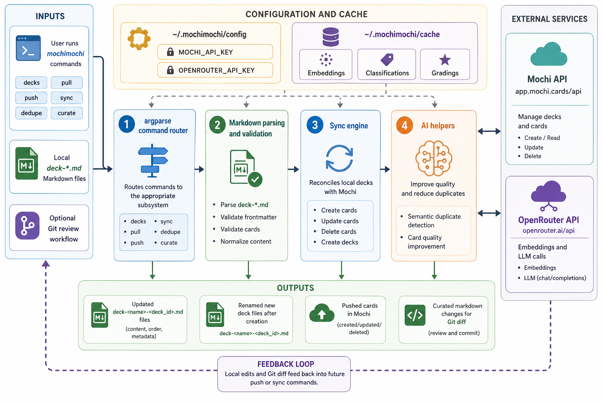

<div align="center">


# mochimochi

**🍡 Local-first CLI for curating [Mochi](https://mochi.cards/) flashcard decks with AI-powered deduplication and quality grading ✨**

</div>

mochimochi is a Python CLI for managing Mochi flashcards from local markdown files. Pull a deck from Mochi, edit it in your own folder, review changes with git, then push or sync the result back to Mochi.

It also includes optional AI workflows for finding semantic duplicates and improving card quality before you sync.

## Install

```bash
uv tool install git+https://github.com/tsilva/mochimochi.git
mochimochi decks
```

The first command installs the CLI. The second lists your Mochi decks and prompts for a Mochi API key if one has not been saved yet.

For local development:

```bash
git clone https://github.com/tsilva/mochimochi.git
cd mochimochi
uv sync --extra dev
uv run mochimochi decks
```

## Commands

```bash
mochimochi decks                         # list available Mochi decks
mochimochi pull <deck_id>                # download a deck to deck-<name>-<deck_id>.md
mochimochi push deck-python-abc123.md    # push local markdown changes to Mochi
mochimochi sync deck-python-abc123.md    # sync local changes and handle remote deletions
mochimochi push                          # push every deck-*.md file in the current directory
mochimochi sync                          # sync every deck-*.md file in the current directory
mochimochi dedupe deck-python-abc123.md  # find and remove semantic duplicates
mochimochi curate deck-python-abc123.md  # grade and improve low-quality cards
```

Useful options:

```bash
mochimochi push deck-python-abc123.md --force       # skip duplicate detection
mochimochi sync deck-python-abc123.md --force       # skip duplicate detection
mochimochi dedupe deck-python-abc123.md --threshold 0.9
mochimochi curate deck-python-abc123.md --threshold 9
```

## Card Format

Deck files are markdown. Existing cards keep their Mochi `card_id`; new cards use `null`.

```markdown
---
card_id: abc123
tags: ["python", "basics"]
---
What is a list comprehension?
---
A concise way to create lists: [x for x in iterable]
---
card_id: null
---
New card question
---
New card answer
```

## Notes

- Requires Python 3.10 or newer.
- Config is stored in `~/.mochimochi/config`.
- `MOCHI_API_KEY` is required for all commands and is prompted on first use.
- `OPENROUTER_API_KEY` is required for `dedupe` and `curate`.
- AI caches are stored in `~/.mochimochi/cache`.
- New local decks can be created as `deck-<name>.md`; the first push creates the Mochi deck and renames the file to include the deck ID.
- Run unit tests with `uv run pytest -m "not integration"`. Live API tests require `TEST_DECK_ID`.

## Architecture



## License

[MIT](LICENSE)
